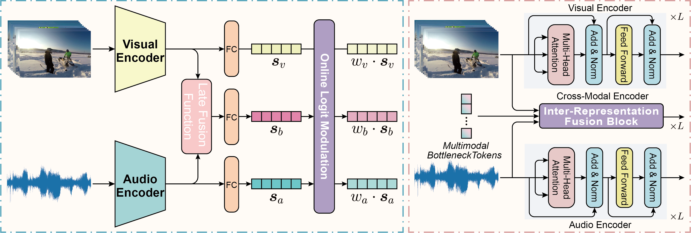
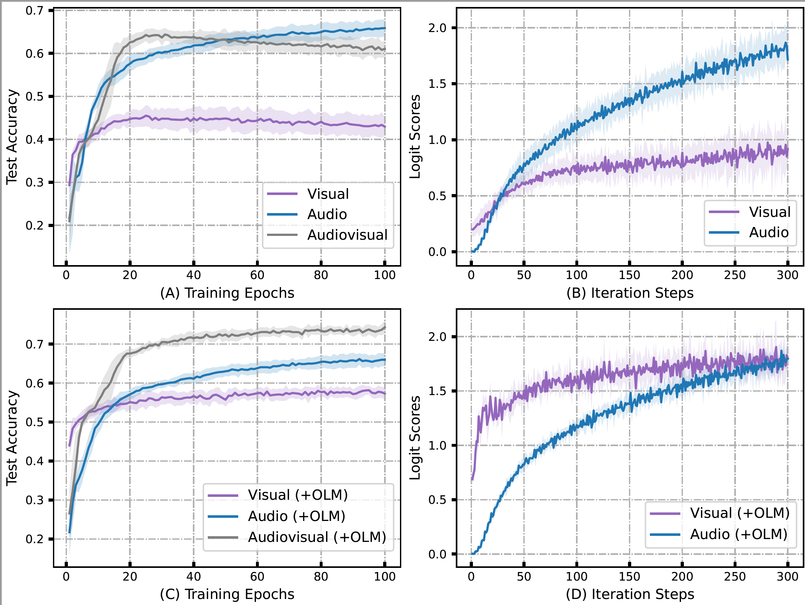

<!-- <h1 align="center"> ✨ A Official Repository for Implementing OLM ✨</h1> -->
<h1 align="center"> ✨✨ A Official Repository for <br>
  Balancing Multimodal Learning via Online Logit Modulation ✨✨</h1>

<p align="center">

  <!-- <h1 align="center">Balancing Multimodal Learning via Online Logit Modulation</h1> -->
  <p align="center">
    <strong>Anonymous Submission <br> Paper ID: 2026</strong>
  </p>
  <h3 align="center"><a href="https://anonymous-gitlab.github.io">Project Page</a></h3>
  <div align="center"></div>
</p>

Welcome to the official repository for implementing OLM (Online Logit Modulation) in PyTorch. This repository serves as the PyTorch implementation of the paper titled "Balancing Multimodal Learning via Online Logit Modulation." OLM is a logit modulation method designed to harmonize the training process of multimodal networks.



Our `OLM` method addresses the imbalanced multimodal learning challenge. `OLM` learns model-agnostic dynamic logit coefficients, accommodating both *late fusion* and *mid fusion* paradigms. The right panel illustrates the generic paradigm of *late fusion*. Following the regulation of logit coefficients, the directions of the logit vectors for each modality remain unchanged, while the magnitudes of these vectors are harmonized to achieve better balance. The right panel demonstrates an exemplar of *mid fusion*.

## :books: Addressing the Imbalanced Multimodal Training Issue

Recent studies have uncovered a significant challenge in multimodal deep neural networks. Many of these networks struggle to outperform their single-modal counterparts. This phenomenon has been extensively explored in prior research. For example:

- The Gradient-Blending method revealed that different modalities tend to overfit and generalize at different rates. Consequently, training them jointly using a single optimization strategy is suboptimal.

- OGM-GE discovered that the better-performing modality often dominates the gradient updates, while suppressing the learning process of other modalities.

- PMR argued that existing multimodal learning methods frequently optimize a uniform objective for different modalities, leading to the well-known modality imbalance problem, where a unimodal learning network often outperforms the multimodal network.

You can find relevant papers here:

- [Gradient-Blending: What makes training multi-modal classification networks hard?](https://openaccess.thecvf.com/content_CVPR_2020/html/Wang_What_Makes_Training_Multi-Modal_Classification_Networks_Hard_CVPR_2020_paper.html) (CVPR 2020)
- [OGM-GE: Balanced Multimodal Learning via On-the-fly Gradient Modulation](https://openaccess.thecvf.com/content/CVPR2022/papers/Peng_Balanced_Multimodal_Learning_via_On-the-Fly_Gradient_Modulation_CVPR_2022_paper.pdf) (CVPR 2022)
- [PMR: Prototypical Modal Rebalance for Multimodal Learning](https://openaccess.thecvf.com/content/CVPR2023/papers/Fan_PMR_Prototypical_Modal_Rebalance_for_Multimodal_Learning_CVPR_2023_paper.pdf) (CVPR 2023)

Our motivation stems from observations depicted in the following figure, where the audio modality significantly contributes to overall performance (see Fig. (A) and (C)). This dominance of the audio modality is evident from the average unimodal logit scores within each batch, while the visual modality persistently remains under-optimized throughout training. Further observations in Fig. (C) and (D) demonstrate that the logit norms corresponding to each category continuously increase during training, and the logit norms of the audio and visual modalities gradually diverge as training progresses.



<!-- ## Introducing `OLM` (Online Logit Modulation) -->


## :rocket: Getting Started

### ⚙️ Cloning and Installation

Clone this repository and install the required packages:

```sh
git clone https://github.com/anonymous-gitlab/OLM.git
cd OLM
```

<!-- ### Dependencies -->

Ensure you have the following dependencies installed on your system:

- Ubuntu 16.04
- CUDA Version: 11.1
- PyTorch 1.8.1
- torchvision 0.9.1
- Python 3.7.6

```sh
pip install -r requirements.txt
```

### :bar_chart: Data Preparation

Download the original datasets used in our experiments:

- [CREMA-D](https://github.com/CheyneyComputerScience/CREMA-D)
- [AVE](https://sites.google.com/view/audiovisualresearch)
- [VGGSound](https://www.robots.ox.ac.uk/~vgg/data/vggsound/)
- [Kinetics-Sounds](https://github.com/cvdfoundation/kinetics-dataset)
- [MER-MULTI](http://merchallenge.cn/mer2023)

### 📈 Data Preprocessing

For CREMA-D and VGGSound datasets, we provide code to preprocess videos into RGB frames and audio WAV files in the `data/` directory.

#### CREMA-D

As the original CREMA-D dataset provides the original audio and video files, you can extract the video frames by running the code:

```python data/CREMAD/video_preprecessing.py```

#### VGGSound

As the original VGGSound dataset only provides the raw video files, you need to extract the audio by running the code:

```python data/VGGSound/mp4_to_wav.py```

Then, extract the video frames:

```python data/VGGSound/video_preprecessing.py```

#### AVE

As the original AVE dataset only provides the raw video files, you need to extract the audio by running the code:

```python data/AVE/mp4_to_wav.py```

Then, extract the video frames:

```python data/AVE/video_preprecessing.py```


#### Kinetics-Sounds

As the original Kinetics-Sounds dataset only provides the raw video files, you need to extract the audio by running the code:

```python data/KineticSound/mp4_to_wav.py```

Then, extract the video frames:

```python data/KineticSound/video_preprecessing.py```


#### MER-MULTI

The original MER-MULTI (2023, Track 1, 3373 samples for Train & Val) dataset provides raw video files. You need to extract the audio using [FFmpeg](https://ffmpeg.org/) and extract face images from video clips using the [OpenFace](https://github.com/cmusatyalab/openface) toolkit. Refer to `config.py` for detailed data configuration for the MER-MULTI dataset.


The directory tree under the `data` folder should look like this:

```sh
data/
├── AVE
│   ├── convert.sh
│   ├── mp4_to_wav.py
│   ├── stat_raw.txt
│   ├── stat.txt
│   └── video_preprocessing.py
├── CREMAD
│   ├── data.csv
│   ├── stat.csv
│   ├── test.csv
│   ├── train.csv
│   └── video_preprocessing.py
├── KineticSound
│   ├── ffmpeg_mp4_2_wav.sh
│   ├── mp4_to_wav.py
│   ├── my_test.txt
│   ├── my_train.txt
│   └── video_preprocessing.py
└── VGGSound
    ├── ffmpeg.sh
    ├── ffmpeg_train.sh
    ├── mp4_to_wav.py
    ├── vggsound.csv
    ├── vggsound_with_head.csv
    ├── video_preprocessing.py
```

## :crown: Core Code Demo

Our `OLM` can be used as a plug-and-play module suitable for various multimodal fusion schemes. Here's a demonstration of the core code:

### `engines/engines_logits_com.py`

```python
# Optimize logit coefficients
logits_norm = torch.stack(logits_norm, dim=-1)
generalization_rate = model.eval_initial_loss - torch.stack([loss_v_eval, loss_a_eval, loss_b_eval]).detach()
convergence_rate = model.train_initial_loss - torch.stack([loss_v, loss_a, loss_b]).detach()

 - generalization_rate
rt = torch.softmax(torch.clamp(generalization_rate, 1e-6) / torch.clamp(convergence_rate, 1e-6), dim=-1)
logits_norm_avg = logits_norm.mean(-1).detach()
constant = (logits_norm_avg.unsqueeze(-1) @ rt.unsqueeze(0)).detach()
logitsnorm_loss = torch.abs(logits_norm - constant).sum()
logitsnorm_loss.backward()
```

### A Variant of `OLM`

### `engines/engines_logits.py`

```python
# Optimize logit coefficients
logits_norm = torch.stack(logits_norm, dim=-1)
loss_ratio = torch.stack([loss_v, loss_a, loss_b]).detach() / model.initial_loss
rt = loss_ratio / loss_ratio.mean()
logits_norm_avg = logits_norm.mean(-1).detach()
constant = (logits_norm_avg.unsqueeze(-1) @ rt.unsqueeze(0)).detach()
logitsnorm_loss = torch.abs(logits_norm - constant).sum()
logitsnorm_loss.backward()
```

### How to Run

For training and evaluation of `OLM-Trans` on MER-MULTI, simply run:

```sh
# Model_type: emt, mbt, umt, ca
bash scripts/run_trans_logits_com.sh ${GPU_id} ${Model_type}
```

For training and evaluation of `OLM-Conv` on AVE, VGGSound, KineticSound, and CREMAD, use the following command:

```sh
# Dataset (optional): AVE, CREMAD, VGGSound, KineticSound
bash scripts/run_logits_com.sh ${GPU_id} ${dataset}
```

## 📄 Citation

If you find this work useful, please consider citing it:

```latex
@inproceedings{xxx,
  title = {Balancing Multimodal Learning via Online Logit Modulation},
  author = {xxx},
  booktitle = {xxx},
  year = {2024}
}
```

## 🙌 Acknowledgement

This research received support from xxx.

## License

## To-Do List

- [1] Support `OLM` DDP training across multiple GPUs on multiple machines.
- [2] Build a MML algorithm package.
- [3] Checkpoint Release.
- [4] Demonstrate OLM training visualization for different multimodal fusion schemes.

## Contact Us

For detailed questions or suggestions, please email us at xxx.
